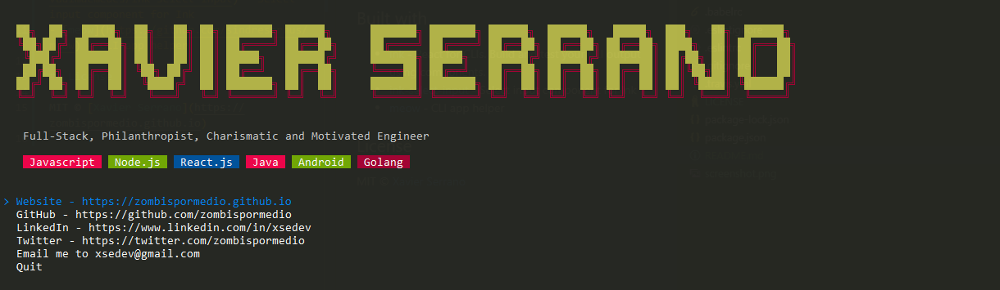

# xsedev

> My Professional Card

## Built with

- [ink](https://github.com/vadimdemedes/ink) - React for CLIs. Build and test your CLI output using components.
- [ink-select-input](https://github.com/vadimdemedes/ink-select-input) - Select input component for Ink
- [meow](https://github.com/sindresorhus/meow) - CLI app helper

## License

MIT © [Xavier Serrano](https://zombispormedio.github.io)
